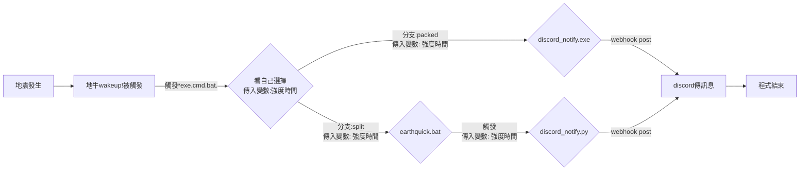

# EEW_discord_notify
地震速報、速報軟件、discord webhook推播、discord webhook推送（配合地牛Wake Up!）
使用python編寫，打包為exe後可直接被觸發


# 使用說明


### 第一步 獲取discord伺服器內的頻道webhook網址

#### 文字頻道點擊右鍵->編輯頻道/點擊齒輪icon->整合->webhook->新增webhook
    


### 第二步 下載zip 解壓縮在想要的路徑
- 路徑不可以有中文
<a href="https://github.com/brianoy/EEW_discord_notify/raw/packed/discord_notify.exe">下載exe最新版本</a>


### 第三步 在地牛wake up!中選擇剛剛解壓縮的discord_notify.exe的路徑
- 路徑不可以有中文


### 第四步 設定discord_notify.ini中webhook的網址及其他細項

1) 點擊discord_notify.ini，用自己習慣的編輯器打開
```ini
[DEFAULT]
1.網址說明 = 請複製discord webhook網址進去，無須加雙引號
webhookurl = https://discord.com/api/webhooks/1000000000000000000/abcdefghijklmnopqrstuvwxyz_ABCDEFGHIJKLMNOPQRSTUVWXYZ123456789000000
2.延遲說明 = 請輸入在程式結束後視窗保留的時間，預設為5秒鐘，無須加雙引號
sleep_time = 5
3.地區說明 = 請輸入在地震訊息發出後，需要被顯示的地區，預設不顯示，為NULL，無須加雙引號
area = NULL
```
2) 把```https://discord.com/api/webhooks/1000000000000000000/abcdefghijklmnopqrstuvwxyz_ABCDEFGHIJKLMNOPQRSTUVWXYZ123456789000000```變成自己的webhook網址
3) 延遲指的是啟動discord_notify.exe後，該視窗存在的時間，若看的到print出來的訊息就可以看到會有倒數的秒數
4) 地區是指原訊息是```警告：地區預計震度5強級地震  預計到達時間:20秒``` 
  
    若設成```area = 台北```即變成```警告：台北地區預計震度5強級  地震預計到達時間:20秒```


### 第五步 在地牛wake up!中點擊測試


### 第六步 看看訊息有沒有跳出來


# icon使用
<a href="https://www.flaticon.com/free-icons/earthquake" title="earthquake icons">Earthquake icons created by Freepik - Flaticon</a>

遵守flaticon.com
的License summary: For commercial and personal projects

# 打包
由<a href="https://pypi.org/project/auto-py-to-exe/">auto-py-to-exe</a> 打包 discord_notify.exe

##### SHA256: 17c98a8ccd88f5ddbe83e72f3642bc2f23cfecb190fb4c76b7b0c3bbf5181ac7

##### CRC64: 1E13AAFE12725A7A

##### MD5: 807eb52396053cb556c40c56e690d8db

# 常見QA
1) 看不到ini檔怎麼辦

> 把discord_notify.exe執行一次後，如果當前目錄沒有ini檔即會再次生成ini檔，可以在裡面調整webhook網址、顯示地區、視窗關閉秒數

2) 為什麼按下測試後只會跳出CMD的介面，不會顯示東西

> 地牛wakeup!中測試按鈕似乎會讓執行的東西都看不到print，如果有debug的需求可以透過tests資料夾的四個測試，直接點開cmd即可  
**注意regenerate_ini_file_test.cmd會將ini刪除**
    
3) 為什麼不直接用windows自帶的curl寫在cmd就好

> 因為curl傳中文字訊息出去會變亂碼，試過改編碼```chcp 65001```依然無解

4) 為什麼看不到編輯頻道的選項

> 因為你沒有該伺服器管理頻道的權限
